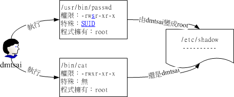
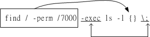

# Linux 檔案與目錄管理

## 目录与路径

### 相对路径与绝对路径

* 绝对路径：路径一定从根目录```/```写起，例如```/usr/share/doc```
* 相对路径：例如```/usr/share/doc```到```/usr/share/man```底下时，可以写成```cd ../man```

### 目录的相关操作

以下是几个特殊目录

```bash
.         代表此層目錄
..        代表上一層目錄
-         代表前一個工作目錄
~         代表『目前使用者身份』所在的家目錄
~account  代表 account 這個使用者的家目錄(account是個帳號名稱)
```

#### cd(change directory)

#### pwd

```bash
[root@study ~]# pwd [-P]
選項與參數：
-P  ：顯示出確實的路徑，而非使用連結 (link) 路徑。

[surwall@localhost ~]$ cd /var/mail
[surwall@localhost mail]$ pwd
/var/mail
[surwall@localhost mail]$ pwd -P
/var/spool/mail
```

#### mkdir

```bash
[root@study ~]# mkdir [-mp] 目錄名稱
選項與參數：
-m ：設定檔案的權限喔！直接設定，不需要看預設權限 (umask) 的臉色～
-p ：幫助你直接將所需要的目錄(包含上層目錄)遞迴建立起來！

[surwall@localhost ~]$ mkdir -m 711 test2
[surwall@localhost ~]$ ls -ld test*
drwx--x--x. 2 surwall surwall 6 Dec  9 10:00 test2
```

#### rmdir

```bash
[root@study ~]# rmdir [-p] 目錄名稱
選項與參數：
-p ：連同『上層』『空的』目錄也一起刪除
```


### 执行档路径的变量：$PATH

PATH前面加$表示变量

```bash
[surwall@localhost ~]$ echo $PATH
/usr/local/bin:/usr/bin:/usr/local/sbin:/usr/sbin:/home/surwall/.local/bin:/home/surwall/bin
```

當我們在執行一個指令的時候，舉例來說『ls』好了，系統會依照PATH的設定去每個PATH定義的目錄下搜尋檔名為ls的可執行檔， 	如果在PATH定義的目錄中含有多個檔名為ls的可執行檔，那麼先搜尋到的同名指令先被執行！

仔細看一下上面的輸出，妳可以發現到無論是root還是dmtsai都有 /bin 或 /usr/bin  	這個目錄在PATH變數內，所以當然就能夠在任何地方執行ls來找到/bin/ls執行檔囉！因為 /bin 在 CentOS 7 當中，就是連結到 /usr/bin 去的！ 	所以這兩個目錄內容會一模一樣！


## 档案与目录管理

### 档案与目录检视：ls

```bash
[root@study ~]# ls [-aAdfFhilnrRSt] 檔名或目錄名稱..
[root@study ~]# ls [--color={never,auto,always}] 檔名或目錄名稱..
[root@study ~]# ls [--full-time] 檔名或目錄名稱..
選項與參數：
-a  ：全部的檔案，連同隱藏檔( 開頭為 . 的檔案) 一起列出來(常用)
-A  ：全部的檔案，連同隱藏檔，但不包括 . 與 .. 這兩個目錄
-d  ：僅列出目錄本身，而不是列出目錄內的檔案資料(常用)
-f  ：直接列出結果，而不進行排序 (ls 預設會以檔名排序！)
-F  ：根據檔案、目錄等資訊，給予附加資料結構，例如：
      *:代表可執行檔； /:代表目錄； =:代表 socket 檔案； |:代表 FIFO 檔案；
-h  ：將檔案容量以人類較易讀的方式(例如 GB, KB 等等)列出來；
-i  ：列出 inode 號碼，inode 的意義下一章將會介紹；
-l  ：長資料串列出，包含檔案的屬性與權限等等資料；(常用)
-n  ：列出 UID 與 GID 而非使用者與群組的名稱 (UID與GID會在帳號管理提到！)
-r  ：將排序結果反向輸出，例如：原本檔名由小到大，反向則為由大到小；
-R  ：連同子目錄內容一起列出來，等於該目錄下的所有檔案都會顯示出來；
-S  ：以檔案容量大小排序，而不是用檔名排序；
-t  ：依時間排序，而不是用檔名。
--color=never  ：不要依據檔案特性給予顏色顯示；
--color=always ：顯示顏色
--color=auto   ：讓系統自行依據設定來判斷是否給予顏色
--full-time    ：以完整時間模式 (包含年、月、日、時、分) 輸出
--time={atime,ctime} ：輸出 access 時間或改變權限屬性時間 (ctime) 
                       而非內容變更時間 (modification time)
```

```bash
[surwall@localhost ~]$ ls -al --full-time ~
total 40
drwx------. 18 surwall surwall 4096 2019-12-09 10:03:33.080047903 -0500 .
drwxr-xr-x.  3 root    root      21 2019-12-04 00:36:23.718377134 -0500 ..
-rw-------.  1 surwall surwall  249 2019-12-09 09:54:36.952594472 -0500 .bash_history
-rw-r--r--.  1 surwall surwall   18 2019-08-08 08:06:55.000000000 -0400 .bash_logout
-rw-r--r--.  1 surwall surwall  193 2019-08-08 08:06:55.000000000 -0400 .bash_profile


```


### 复制、删除与移动：cp, rm, mv

#### cp

```bash
[root@study ~]# cp [-adfilprsu] 來源檔(source) 目標檔(destination)
[root@study ~]# cp [options] source1 source2 source3 .... directory
選項與參數：
-a  ：相當於 -dr --preserve=all 的意思，至於 dr 請參考下列說明；(常用)
-d  ：若來源檔為連結檔的屬性(link file)，則複製連結檔屬性而非檔案本身；
-f  ：為強制(force)的意思，若目標檔案已經存在且無法開啟，則移除後再嘗試一次；
-i  ：若目標檔(destination)已經存在時，在覆蓋時會先詢問動作的進行(常用)
-l  ：進行硬式連結(hard link)的連結檔建立，而非複製檔案本身；
-p  ：連同檔案的屬性(權限、用戶、時間)一起複製過去，而非使用預設屬性(備份常用)；
-r  ：遞迴持續複製，用於目錄的複製行為；(常用)
-s  ：複製成為符號連結檔 (symbolic link)，亦即『捷徑』檔案；
-u  ：destination 比 source 舊才更新 destination，或 destination 不存在的情況下才複製。
--preserve=all ：除了 -p 的權限相關參數外，還加入 SELinux 的屬性, links, xattr 等也複製了。
最後需要注意的，如果來源檔有兩個以上，則最後一個目的檔一定要是『目錄』才行！
```

```bash
[root@localhost ~]# cd /tmp
[root@localhost tmp]# cp /var/log/wtmp .
[root@localhost tmp]# ls -l /var/log/wtmp wtmp
-rw-rw-r--. 1 root utmp 8832 Dec  9 11:11 /var/log/wtmp
-rw-r--r--. 1 root root 8832 Dec  9 11:18 wtmp
# 注意上面的特殊字體，在不加任何選項的情況下，檔案的某些屬性/權限會改變；

[root@localhost tmp]# cp -a /var/log/wtmp wtmp_2
[root@localhost tmp]# ls -l /var/log/wtmp wtmp_2
-rw-rw-r--. 1 root utmp 8832 Dec  9 11:11 /var/log/wtmp
-rw-rw-r--. 1 root utmp 8832 Dec  9 11:11 wtmp_2
```

由於具有這個特性，因此當我們在進行備份的時候，某些需要特別注意的特殊權限檔案， 	例如密碼檔 (/etc/shadow) 以及一些設定檔，就不能直接以 cp 來複製，而必須要加上 -a 或者是 -p  	等等可以完整複製檔案權限的選項才行！

```bash
[root@localhost tmp]# ls -l bashrc
-rw-r--r--. 1 root root 176 Dec  9 11:15 bashrc
[root@localhost tmp]# cp -s bashrc bashrc_slink
[root@localhost tmp]# cp -l bashrc bashrc_hlink
[root@localhost tmp]# ls -l bashrc*
-rw-r--r--. 2 root root 176 Dec  9 11:15 bashrc
-rw-r--r--. 2 root root 176 Dec  9 11:15 bashrc_hlink
lrwxrwxrwx. 1 root root   6 Dec  9 11:38 bashrc_slink -> bashrc

```

#### rm

```bash
[root@study ~]# rm [-fir] 檔案或目錄
選項與參數：
-f  ：就是 force 的意思，忽略不存在的檔案，不會出現警告訊息；
-i  ：互動模式，在刪除前會詢問使用者是否動作
-r  ：遞迴刪除啊！最常用在目錄的刪除了！這是非常危險的選項！！！
```

```bash
# 因為身份是 root ，預設已經加入了 -i 的選項，所以你要一直按 y 才會刪除！
# 如果不想要繼續按 y ，可以按下『 [ctrl]-c 』來結束 rm 的工作。
# 這是一種保護的動作，如果確定要刪除掉此目錄而不要詢問，可以這樣做：
[root@study tmp]# \rm -r /tmp/etc
# 在指令前加上反斜線，可以忽略掉 alias 的指定選項喔！至於 alias 我們在bash再談！
# 拜託！這個範例很可怕！你不要刪錯了！刪除 /etc 系統是會掛掉的！
```

#### mv

```bash
[root@study ~]# mv [-fiu] source destination
[root@study ~]# mv [options] source1 source2 source3 .... directory
選項與參數：
-f  ：force 強制的意思，如果目標檔案已經存在，不會詢問而直接覆蓋；
-i  ：若目標檔案 (destination) 已經存在時，就會詢問是否覆蓋！
-u  ：若目標檔案已經存在，且 source 比較新，才會更新 (update)

```

### 取得路径的档案名称与目录名称

每个档名的长度都可以达到255字节

```bash
[root@localhost tmp]# basename /etc/sysconfig/network
network
[root@localhost tmp]# dirname /etc/sysconfig/network
/etc/sysconfig
```


## 档案内容查询

### 直接监视档案内容：cat, tac, nl

#### cat

```bash
[root@study ~]# cat [-AbEnTv]
選項與參數：
-A  ：相當於 -vET 的整合選項，可列出一些特殊字符而不是空白而已；
-b  ：列出行號，僅針對非空白行做行號顯示，空白行不標行號！
-E  ：將結尾的斷行字元 $ 顯示出來；
-n  ：列印出行號，連同空白行也會有行號，與 -b 的選項不同；
-T  ：將 [tab] 按鍵以 ^I 顯示出來；
-v  ：列出一些看不出來的特殊字符
```

#### tac

反向显示

#### nl

```bash
[root@study ~]# nl [-bnw] 檔案
選項與參數：
-b  ：指定行號指定的方式，主要有兩種：
      -b a ：表示不論是否為空行，也同樣列出行號(類似 cat -n)；
      -b t ：如果有空行，空的那一行不要列出行號(預設值)；
-n  ：列出行號表示的方法，主要有三種：
      -n ln ：行號在螢幕的最左方顯示；
      -n rn ：行號在自己欄位的最右方顯示，且不加 0 ；
      -n rz ：行號在自己欄位的最右方顯示，且加 0 ；
-w  ：行號欄位的佔用的字元數。
```


### 可翻页检视：more, less

#### more

* /字串     ：代表在這個顯示的內容當中，向下搜尋『字串』這個關鍵字；
* :f       ：立刻顯示出檔名以及目前顯示的行數；
* b 或 [ctrl]-b ：代表往回翻頁，不過這動作只對檔案有用，對管線無用。

#### less

* /字串   ：向下搜尋『字串』的功能；
* ?字串   ：向上搜尋『字串』的功能；
* n     ：重複前一個搜尋 (與 / 或 ? 有關！)
* N     ：反向的重複前一個搜尋 (與 / 或 ? 有關！)
* g     ：前進到這個資料的第一行去；
* G     ：前進到這個資料的最後一行去 (注意大小寫)；


### 资料撷取：head, tail

#### head

```bash
[root@study ~]# head [-n number] 檔案 
選項與參數：
-n  ：後面接數字，代表顯示幾行的意思

範例：如果後面100行的資料都不列印，只列印/etc/man_db.conf的前面幾行，該如何是好？
[root@study ~]# head -n -100 /etc/man_db.conf
```

#### tail

```bash
[root@study ~]# tail [-n number] 檔案 
選項與參數：
-n  ：後面接數字，代表顯示幾行的意思
-f  ：表示持續偵測後面所接的檔名，要等到按下[ctrl]-c才會結束tail的偵測

範例一：如果不知道/etc/man_db.conf有幾行，卻只想列出100行以後的資料時？
[root@study ~]# tail -n +100 /etc/man_db.conf


```


### 非纯文字档：od

```bash
[root@study ~]# od [-t TYPE] 檔案
選項或參數：
-t  ：後面可以接各種『類型 (TYPE)』的輸出，例如：
      a       ：利用預設的字元來輸出；
      c       ：使用 ASCII 字元來輸出
      d[size] ：利用十進位(decimal)來輸出資料，每個整數佔用 size bytes ；
      f[size] ：利用浮點數值(floating)來輸出資料，每個數佔用 size bytes ；
      o[size] ：利用八進位(octal)來輸出資料，每個整數佔用 size bytes ；
      x[size] ：利用十六進位(hexadecimal)來輸出資料，每個整數佔用 size bytes ；
      
範例二：請將/etc/issue這個檔案的內容以8進位列出儲存值與ASCII的對照表
[root@study ~]# od -t oCc /etc/issue
```


### 修改档案时间与建立新档：touch

每个档案有许多时间参数，最主要是三个：

* **modification time (mtime)**：

  當該檔案的『內容資料』變更時，就會更新這個時間！

* **status time (ctime)**：

  當該檔案的『狀態 (status)』改變時，就會更新這個時間，舉例來說，像是權限與屬性被更改了，都會更新這個時間啊。 	

* **access time (atime)**：

  當『該檔案的內容被取用』時，就會更新這個讀取時間 (access)。

```bash
[root@study ~]# date; ls -l /etc/man_db.conf ; ls -l --time=atime /etc/man_db.conf ; \
> ls -l --time=ctime /etc/man_db.conf # 這兩行其實是同一行喔！用分號隔開
```

```bash
[root@study ~]# touch [-acdmt] 檔案
選項與參數：
-a  ：僅修訂 access time；
-c  ：僅修改檔案的時間，若該檔案不存在則不建立新檔案；
-d  ：後面可以接欲修訂的日期而不用目前的日期，也可以使用 --date="日期或時間"
-m  ：僅修改 mtime ；
-t  ：後面可以接欲修訂的時間而不用目前的時間，格式為[YYYYMMDDhhmm]


範例三：修改案例二的 bashrc 檔案，將日期調整為兩天前
[dmtsai@study tmp]# touch -d "2 days ago" bashrc
[dmtsai@study tmp]# date; ll bashrc; ll --time=atime bashrc; ll --time=ctime bashrc
Tue Jun 16 00:51:52 CST 2015
-rw-r--r--. 1 dmtsai dmtsai 231 Jun 14 00:51 bashrc
-rw-r--r--. 1 dmtsai dmtsai 231 Jun 14 00:51 bashrc
-rw-r--r--. 1 dmtsai dmtsai 231 Jun 16 00:51 bashrc
```

無論如何， touch 這個指令最常被使用的情況是：

- 建立一個空的檔案；
- 將某個檔案日期修訂為目前 (mtime 與 atime)


## 档案与目录的预设权限与隐藏权限

### 档案预设权限：umask

在Linux傳統的Ext2/Ext3/Ext4檔案系統下，我們還可以設定其他的系統隱藏屬性， 這部份可使用 [chattr](https://linux.vbird.org/linux_basic/centos7/0220filemanager.php#chattr) 來設定，而以 [lsattr](https://linux.vbird.org/linux_basic/centos7/0220filemanager.php#lsattr)  來查看，最重要的屬性就是可以設定其不可修改的特性！

- 若使用者建立為『檔案』則預設『沒有可執行( x )權限』，亦即只有 rw 這兩個項目，也就是最大為  		666 分，預設權限如下：
   		```-rw-rw-rw-```
- 若使用者建立為『目錄』，則由於 x 與是否可以進入此目錄有關，因此預設為所有權限均開放，亦即為  		777 分，預設權限如下：
   		```drwxrwxrwx```

##### 设定umask

```bash
[root@study ~]# umask 002
```


### 档案隐藏属性：chattr, lsattr

#### chattr

```bash
[root@study ~]# chattr [+-=][ASacdistu] 檔案或目錄名稱
選項與參數：
+   ：增加某一個特殊參數，其他原本存在參數則不動。
-   ：移除某一個特殊參數，其他原本存在參數則不動。
=   ：設定一定，且僅有後面接的參數

A  ：當設定了 A 這個屬性時，若你有存取此檔案(或目錄)時，他的存取時間 atime 將不會被修改，
     可避免 I/O 較慢的機器過度的存取磁碟。(目前建議使用檔案系統掛載參數處理這個項目)
S  ：一般檔案是非同步寫入磁碟的(原理請參考前一章sync的說明)，如果加上 S 這個屬性時，
     當你進行任何檔案的修改，該更動會『同步』寫入磁碟中。
a  ：當設定 a 之後，這個檔案將只能增加資料，而不能刪除也不能修改資料，只有root 才能設定這屬性
c  ：這個屬性設定之後，將會自動的將此檔案『壓縮』，在讀取的時候將會自動解壓縮，
     但是在儲存的時候，將會先進行壓縮後再儲存(看來對於大檔案似乎蠻有用的！)
d  ：當 dump 程序被執行的時候，設定 d 屬性將可使該檔案(或目錄)不會被 dump 備份
i  ：這個 i 可就很厲害了！他可以讓一個檔案『不能被刪除、改名、設定連結也無法寫入或新增資料！』
     對於系統安全性有相當大的助益！只有 root 能設定此屬性
s  ：當檔案設定了 s 屬性時，如果這個檔案被刪除，他將會被完全的移除出這個硬碟空間，
     所以如果誤刪了，完全無法救回來了喔！
u  ：與 s 相反的，當使用 u 來設定檔案時，如果該檔案被刪除了，則資料內容其實還存在磁碟中，
     可以使用來救援該檔案喔！
注意1：屬性設定常見的是 a 與 i 的設定值，而且很多設定值必須要身為 root 才能設定
注意2：xfs 檔案系統僅支援 ASadi 而已

範例：請嘗試到/tmp底下建立檔案，並加入 i 的參數，嘗試刪除看看。
[root@study ~]# cd /tmp
[root@study tmp]# touch attrtest     <==建立一個空檔案
[root@study tmp]# chattr +i attrtest <==給予 i 的屬性
[root@study tmp]# rm attrtest        <==嘗試刪除看看
rm: remove regular empty file `attrtest'? y
rm: cannot remove `attrtest': Operation not permitted
```

#### lsattr

```bash
[root@study ~]# lsattr [-adR] 檔案或目錄
選項與參數：
-a ：將隱藏檔的屬性也秀出來；
-d ：如果接的是目錄，僅列出目錄本身的屬性而非目錄內的檔名；
-R ：連同子目錄的資料也一併列出來！ 
```


### 档案特殊权限：SUID, SGID, SBIT, 权限设定

```bash
drwxrwxrwt. 18 root root 4096 Dec 11 10:19 /tmp
-rwsr-xr-x. 1 root root 27856 Aug  8 21:39 /usr/bin/passwd
```

#### Set UID

当拥有者(owner)权限上的x变为s，被称为Set UID

- SUID 權限僅對二進位程式(binary program)有效；
- 執行者對於該程式需要具有 x  的可執行權限；
- 本權限僅在執行該程式的過程中有效 (run-time)；
- 執行者將具有該程式擁有者 (owner) 的權限。



#### Set GID

群组的x变为s，则被成为Set GID，SGID。

```bash
[surwall@localhost ~]$ ll /usr/bin/locate
-rwx--s--x. 1 root slocate 40520 Apr 10  2018 /usr/bin/locate
```

- SGID 對二進位程式有用；
- 程式執行者對於該程式來說，需具備 x 的權限；
- 執行者在執行的過程中將會獲得該程式群組的支援！

```bash
[root@localhost surwall]# ll /usr/bin/locate /var/lib/mlocate/mlocate.db
-rwx--s--x. 1 root slocate   40520 Apr 10  2018 /usr/bin/locate
-rw-r-----. 1 root slocate 2892155 Dec 11 09:51 /var/lib/mlocate/mlocate.db
```

當一個目錄設定了 SGID 的權限後，他將具有如下的功能：

- 使用者若對於此目錄具有 r 與 x 的權限時，該使用者能夠進入此目錄；
- 使用者在此目錄下的有效群組(effective group)將會變成該目錄的群組；
- 用途：若使用者在此目錄下具有 w 的權限(可以新建檔案)，則使用者所建立的新檔案，該新檔案的群組與此目錄的群組相同。

#### Sticky Bit

SBIT现在只针对目录有效。

#### 权限设定

修改权限为三个数字，那么再在数字前加一个数字，就代表这个权限了

- 4 為 SUID
- 2 為 SGID
- 1 為 SBIT

```bash
[surwall@localhost tmp]$ chmod 7666 test; ll test
-rwSrwSrwT. 1 surwall surwall 0 Dec 11 11:08 test
```

大S、T是因为档案拥有者没有执行权限，所以大S、T也没有执行权限。

也可以通过符号法设置

其中 SUID 為 u+s ，而 SGID 為 g+s ，SBIT 	則是 o+t 


### 观察档案类型：file

如果你想要知道某個檔案的基本資料，例如是屬於 ASCII 或者是 data 檔案，或者是 binary ， 	且其中有沒有使用到動態函式庫 (share library) 等等的資訊，就可以利用 file 這個指令來檢閱喔！

```bash
[root@study ~]# file ~/.bashrc
```


## 指令与档案的搜寻

### 指令档名的搜寻：which

```bash
[root@study ~]# which [-a] command
選項或參數：
-a ：將所有由 PATH 目錄中可以找到的指令均列出，而不止第一個被找到的指令名稱
```


### 档案档名的搜寻：whereis, locate/updatedb, find

通常 find 不很常用的！因為速度慢之外， 	也很操硬碟！

#### whereis

```bash
[root@study ~]# whereis [-bmsu] 檔案或目錄名
選項與參數：
-l    :可以列出 whereis 會去查詢的幾個主要目錄而已
-b    :只找 binary 格式的檔案
-m    :只找在說明檔 manual 路徑下的檔案
-s    :只找 source 來源檔案
-u    :搜尋不在上述三個項目當中的其他特殊檔案
```

#### locate / updatedb

```bash
[root@study ~]# locate [-ir] keyword
選項與參數：
-i  ：忽略大小寫的差異；
-c  ：不輸出檔名，僅計算找到的檔案數量
-l  ：僅輸出幾行的意思，例如輸出五行則是 -l 5
-S  ：輸出 locate 所使用的資料庫檔案的相關資訊，包括該資料庫紀錄的檔案/目錄數量等
-r  ：後面可接正規表示法的顯示方式
```

#### find

```bash
[root@study ~]# find [PATH] [option] [action]
選項與參數：
1. 與時間有關的選項：共有 -atime, -ctime 與 -mtime ，以 -mtime 說明
   -mtime  n ：n 為數字，意義為在 n 天之前的『一天之內』被更動過內容的檔案；
   -mtime +n ：列出在 n 天之前(不含 n 天本身)被更動過內容的檔案檔名；
   -mtime -n ：列出在 n 天之內(含 n 天本身)被更動過內容的檔案檔名。
   -newer file ：file 為一個存在的檔案，列出比 file 還要新的檔案檔名

範例一：將過去系統上面 24 小時內有更動過內容 (mtime) 的檔案列出
[root@study ~]# find / -mtime 0
# 那個 0 是重點！0 代表目前的時間，所以，從現在開始到 24 小時前，
# 有變動過內容的檔案都會被列出來！那如果是三天前的 24 小時內？
# find / -mtime 3 有變動過的檔案都被列出的意思！

範例二：尋找 /etc 底下的檔案，如果檔案日期比 /etc/passwd 新就列出
[root@study ~]# find /etc -newer /etc/passwd
# -newer 用在分辨兩個檔案之間的新舊關係是很有用的！
```


- +4代表大於等於5天前的檔名：ex> find /var -mtime +4
- -4代表小於等於4天內的檔案檔名：ex> find /var -mtime -4
-  4則是代表4-5那一天的檔案檔名：ex> find /var -mtime 4

```bash
2. 與使用者或群組名稱有關的參數：
   -uid n ：n 為數字，這個數字是使用者的帳號 ID，亦即 UID ，這個 UID 是記錄在
            /etc/passwd 裡面與帳號名稱對應的數字。
   -gid n ：n 為數字，這個數字是群組名稱的 ID，亦即 GID，這個 GID 記錄在
            /etc/group
   -user name ：name 為使用者帳號名稱喔！例如 dmtsai 
   -group name：name 為群組名稱喔，例如 users ；
   -nouser    ：尋找檔案的擁有者不存在 /etc/passwd 的人！
   -nogroup   ：尋找檔案的擁有群組不存在於 /etc/group 的檔案！
                當你自行安裝軟體時，很可能該軟體的屬性當中並沒有檔案擁有者，
                這是可能的！在這個時候，就可以使用 -nouser 與 -nogroup 搜尋。
                
3. 與檔案權限及名稱有關的參數：
   -name filename：搜尋檔案名稱為 filename 的檔案；
   -size [+-]SIZE：搜尋比 SIZE 還要大(+)或小(-)的檔案。這個 SIZE 的規格有：
                   c: 代表 byte， k: 代表 1024bytes。所以，要找比 50KB
                   還要大的檔案，就是『 -size +50k 』
   -type TYPE    ：搜尋檔案的類型為 TYPE 的，類型主要有：一般正規檔案 (f), 裝置檔案 (b, c),
                   目錄 (d), 連結檔 (l), socket (s), 及 FIFO (p) 等屬性。
   -perm mode  ：搜尋檔案權限『剛好等於』 mode 的檔案，這個 mode 為類似 chmod
                 的屬性值，舉例來說， -rwsr-xr-x 的屬性為 4755 ！
   -perm -mode ：搜尋檔案權限『必須要全部囊括 mode 的權限』的檔案，舉例來說，
                 我們要搜尋 -rwxr--r-- ，亦即 0744 的檔案，使用 -perm -0744，
                 當一個檔案的權限為 -rwsr-xr-x ，亦即 4755 時，也會被列出來，
                 因為 -rwsr-xr-x 的屬性已經囊括了 -rwxr--r-- 的屬性了。
   -perm /mode ：搜尋檔案權限『包含任一 mode 的權限』的檔案，舉例來說，我們搜尋
                 -rwxr-xr-x ，亦即 -perm /755 時，但一個檔案屬性為 -rw-------
                 也會被列出來，因為他有 -rw.... 的屬性存在！

```

上述範例中比較有趣的就屬 -perm 這個選項啦！他的重點在找出特殊權限的檔案囉！ 	我們知道 SUID 與 SGID 都可以設定在二進位程式上，假設我想要找出來 /usr/bin, /usr/sbin 這兩個目錄下， 	只要具有 SUID 或 SGID 就列出來該檔案，你可以這樣做：

```bash
[surwall@localhost home]$ find /usr/bin /usr/sbin -perm /6000
```

```bash
4. 額外可進行的動作：
   -exec command ：command 為其他指令，-exec 後面可再接額外的指令來處理搜尋到的結果。
   -print        ：將結果列印到螢幕上，這個動作是預設動作！
   
範例八：將上個範例找到的檔案使用 ls -l 列出來～
[root@study ~]# find /usr/bin /usr/sbin -perm /7000 -exec ls -l {} \;
# 注意到，那個 -exec 後面的 ls -l 就是額外的指令，指令不支援命令別名，
# 所以僅能使用 ls -l 不可以使用 ll 喔！注意注意！
```

find 的特殊功能就是能夠進行額外的動作(action)。



該範例中特殊的地方有 {} 以及 \; 還有 -exec 這個關鍵字，這些東西的意義為：

- {} 代表的是『由 find 找到的內容』，如上圖所示，find 的結果會被放置到 {} 位置中；
- -exec 一直到  \; 是關鍵字，代表 find 額外動作的開始 (-exec) 到結束 (\;) ，在這中間的就是 find 指令內的額外動作。 	在本例中就是『 ls -l {} 』囉！
- 因為『 ; 』在 bash 環境下是有特殊意義的，因此利用反斜線來跳脫。

如果你要找的檔案是具有特殊屬性的，例如 SUID 、檔案擁有者、檔案大小等等， 	那麼利用 locate 是沒有辦法達成你的搜尋的！此時 find 就顯的很重要啦！ 	另外，find 還可以利用萬用字元來找尋檔名呢！

***

```bash
5. find的多个条件组合
expr1 -a expr2 # and
expr1 -o expr2 # or
! expr1 # not
find /etc -size +50k -a -size -60k -exec ls -l {} \;
find /etc -size +50k -a ! -user root -exec ls -ld {} \;
find /etc -size +50k -a ! -user root -type f -exec ls -l {} \;
find /etc -size +1500k -o -size 0
```

