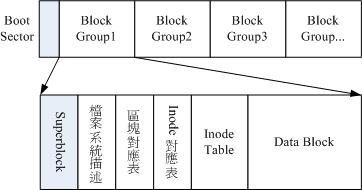
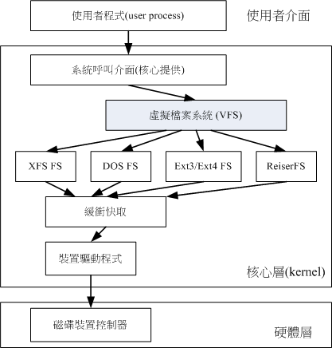

# 磁碟与档案系统管理

## 认识Linux档案系统

Linux最初档案系统使用的是EXT2。档案系统是建立在磁盘上的。

### 档案系统特性

磁碟分割完后需要格式化，系统才能使用这个系统档案系统。因为每个系统的档案属性/权限各不相同，为了存放这些档案所需的资料，因此需要将分割槽进行格式化。

每个系统能使用的档案系统并不相同。Windows 98以前的微软系统主要使用FAT(或FAT16)，windows2000后有所谓的NTFS。Linux正统档案系统则为Ext2(Linux second extended file system)。因此，windows默认不能识别Ext2。

傳統的磁碟與檔案系統之應用中，一個分割槽就是只能夠被格式化成為一個檔案系統，所以我們可以說一個 filesystem 	就是一個 partition。但是由於新技術的利用，例如我們常聽到的LVM與軟體磁碟陣列(software raid)， 	這些技術可以將一個分割槽格式化為多個檔案系統(例如LVM)，也能夠將多個分割槽合成一個檔案系統(LVM, RAID)！ 	所以說，目前我們在格式化時已經不再說成針對 partition 來格式化了， 	通常我們可以稱呼一個可被掛載的資料為一個檔案系統而不是一個分割槽喔！

較新的作業系統的檔案資料除了檔案實際內容外， 	通常含有非常多的屬性，例如 Linux 作業系統的檔案權限(rwx)與檔案屬性(擁有者、群組、時間參數等)。 	檔案系統通常會將這兩部份的資料分別存放在不同的區塊，權限與屬性放置到  	inode 中，至於實際資料則放置到 data block 區塊中。 	另外，還有一個超級區塊 (superblock) 會記錄整個檔案系統的整體資訊，包括 inode 與 block 的總量、使用量、剩餘量等。

每個 inode 與 block 都有編號，至於這三個資料的意義可以簡略說明如下：

- superblock：記錄此 filesystem 的整體資訊，包括inode/block的總量、使用量、剩餘量， 	以及檔案系統的格式與相關資訊等；
- inode：記錄檔案的屬性，一個檔案佔用一個inode，同時記錄此檔案的資料所在的 block 號碼；
- block：實際記錄檔案的內容，若檔案太大時，會佔用多個 block 。

***

如下图所示，假设一个档案属性与权限资料放在inode4号，这个inode记录了实际放置点为2, 7,13, 15这四个block号码。


这种存储资料的方法我们称为索引式档案系统(indexed allocation)。我们平时使用的优盘，一般使用的FAT。FAT这种格式档案系统并没有inode存在，所以FAT无法将这个档案的所有block一开始读取出来。每个block号码都记录在前一个block当中。


常常會聽到所謂的『磁碟重組』吧？需要磁碟重組的原因就是檔案寫入的 block 太過於離散了，此時檔案讀取的效能將會變的很差所致。 	這個時候可以透過磁碟重組將同一個檔案所屬的 blocks 彙整在一起，這樣資料的讀取會比較容易啊！

### Linux的EXT2档案系统(inode)

而且檔案系統一開始就將 inode 與 block 規劃好了，除非重新格式化(或者利用 resize2fs  	等指令變更檔案系統大小)，否則 inode 與 block 固定後就不再變動。但是如果仔細考慮一下，如果我的檔案系統高達數百GB時， 	那麼將所有的 inode 與 block 通通放置在一起將是很不智的決定，因為 inode 與 block 的數量太龐大，不容易管理。

為此之故，因此 Ext2 檔案系統在格式化的時候基本上是區分為多個區塊群組 (block group) 的，每個區塊群組都有獨立的  	inode/block/superblock 系統。



每一個區塊群組(block group)的六個主要內容說明如後：

#### data block (資料區塊)

| Block大小          | 1KB  | 2KB   | 4KB  |
| ------------------ | ---- | ----- | ---- |
| 最大单一档案限制   | 16GB | 256GB | 2TB  |
| 最大档案系统总容量 | 2TB  | 8TB   | 16TB |

Ext2还有如下限制:

* 原則上，block 的大小與數量在格式化完就不能夠再改變了(除非重新格式化)；
* 每個 block 內最多只能夠放置一個檔案的資料；

#### inode table (inode 表格)

inode记录的资料就是使用ls -l所显示的数据。

inode的大小与数量在格式化时就已经固定了

* inode大小固定为128 bytes (新的ext4与xfs可设定到256 bytes)
* 每个档案只占用一个inode
* 因此，档案系统能够建立的档案与inode书香有关
* 系统读取时先找到inode，并分析inode所记录的权限与使用者是否符合。

inode记录的资料非常多，偏偏只有128bytes而已，inode记录一个block号码要花掉4byte。如果要记录一个400MB的档案，需要十万个block号码的记录，但这是不可能的。所以，系统将inode记录block号码的区域定义为12个直接，一个间接，一个双间接，一个三间接记录区。


那么inode能指定多少个block呢？我们已1k block来说明，可指定的情况如下：

* 12个直接指向：12 * 1K = 12k

* 间接：(1024 / 4) * 1K = 256 * 1K = 256K

  记录每个block号码需要4bytes，所以1k大小的block能记录256笔记录

* 双间接：256 * 256 * 1K = 256^2K

* 三间接：256 * 256 * 256 * 1K = 256^3K

* 总额：16GB

但这个方法不能用在2k及4k block大小的计算中，因为大于2k的block将会收到Ext2档案系统本身的限制。

#### SuperBlock(超级区块)

Superblock 是記錄整個 filesystem 相關資訊的地方，记录的资料有：

- block 與 inode 的總量；
- 未使用與已使用的 inode / block 數量；
- block 與 inode 的大小 (block 為 1, 2, 4K，inode 為 128bytes 或 256bytes)；
- filesystem 的掛載時間、最近一次寫入資料的時間、最近一次檢驗磁碟 (fsck) 的時間等檔案系統的相關資訊；
- 一個 valid bit 數值，若此檔案系統已被掛載，則 valid bit 為 0 ，若未被掛載，則 valid bit 為 1 。

一般来说，superblock的大小为1024bytes。相关的superblock讯息用```dumpe2fs```指令查看。

此外，每个block group都有可能含有super block。后续如果含有superblock主要是为了第一个block group内的superblock的备份。

#### Filesystem Description (檔案系統描述說明)

這個區段可以描述每個 block group 的開始與結束的 block 號碼，以及說明每個區段 (superblock, bitmap, inodemap, 	data block) 分別介於哪一個 block 號碼之間。

#### block bitmap (區塊對照表)

从block bitmap当中可以知道哪些block是空的。

#### inode bitmap (inode 對照表)

记录使用与未使用的inode号码

#### dumpe2fs：查询superblock

新的xfs无法使用这个指令


### 与目录树的关系

#### 目录

我们建立一个目录时，档案系统至少会分配一个inode与至少一块block给该目录。inode记录该目录的相关权限与属性，并记录分配的那块block号码，block则是记录这个目录下的档名与该档名占用的inode号码资料。


#### 档案

当在ext2建立一般档案时，ext2分配一个inode和若干block

#### 目录树读取

新增/删除/改名档名与目录的W权限有关，是因为档名记录在目录的block当中，读取某个档案时，必须经过目录的inode与block

目录树是从根目录读取，因此通过系统挂载的资讯找到挂载点的inode号码，此时能够得到根目录的inode内容。如果要读取```/etc/password```

```bash
[surwall@localhost ~]$ ll -di / /etc /etc/passwd
      96 dr-xr-xr-x.  17 root root  224 Dec  4 00:36 /
16797793 drwxr-xr-x. 140 root root 8192 Dec 13 06:08 /etc
18045119 -rw-r--r--.   1 root root 2268 Dec  4 00:36 /etc/passwd
```


### EXT2/EXT3/EXT4 檔案的存取與日誌式檔案系統的功能

如果我们想要增加一个档案，此时档案系统的行为是：

1. 确定该目录是否有w与x权限
2. 根据inode bitmap找到没有使用的inode号码，并将权限/属性写入
3. 根据block bitmap找到闲置的block号码，资料写入，且更新inode的block指向资料
4. 将刚刚写入的inode与block资料同步更新inode bitmap与block bitmap，并更新superblock内容

一般将inode table与data block称为资料存放区域，其他区域称为metadata(中介资料)。

#### 资料的不一致(inconsistent)

当写入资料时，系统突然中断，所以写入的资料仅有inode table及data block而已，所以metadata内容与实际资料存放区产生不一致的情况了。

#### 日志式档案系统(Journaling filesystem)

1. 预备：当系统写入一个档案时，会在日志记录区块中记录某个档案准备要写入的资讯
2. 实际写入：开始写入权限的权限与资料；开始更新metadata资料
3. 结束：完成资料与metadata更新后，在日志记录区块完成该档案的记录

### Linux档案系统的运作

磁碟写入的速度比记忆体慢很多，因此常耗在等待磁碟的写入/读取上。

因此解决这个效率的问题，因此Linux是透过一个称为异步处理的方式。當系統載入一個檔案到記憶體後，如果該檔案沒有被更動過，則在記憶體區段的檔案資料會被設定為乾淨(clean)的。但如果記憶體中的檔案資料被更改過了(例如你用 nano去編輯過這個檔案)，此時該記憶體中的資料會被設定為髒的(Dirty)。此時所有的動作都還在記憶體中執行，並沒有寫入到磁碟中！系統會不定時的將記憶體中設定為『Dirty』的資料寫回磁碟，以保持磁碟與記憶體資料的一致性。也可以利用sync指令。

### 挂载点的意义(mount point)

將檔案系統與目錄樹結合的動作我們稱為『掛載』。掛載點一定是目錄，該目錄為進入該檔案系統的入口。

### 其他 Linux 支援的檔案系統與 VFS

- 傳統檔案系統：ext2 / minix / MS-DOS / FAT (用 vfat 模組) / iso9660 (光碟)等等；
- 日誌式檔案系統： ext3 /ext4 / ReiserFS / Windows' NTFS / IBM's JFS / SGI's XFS / ZFS
- 網路檔案系統： NFS / SMBFS 

查看linux支持的系统：

```bash
[surwall@localhost /]$ ls -l /lib/modules/$(uname -r)/kernel/fs
```

系统已经载入记忆体中支援的档案系统有：

```bash
cat /proc/filesystems
```

#### Linux VFS (Virtual Filesystem Switch)

整個 Linux 的系統都是透過一個名為 Virtual Filesystem Switch 的核心功能去讀取 filesystem 的。



### XFS 檔案系統簡介

xfs主要有三个部分：

* 資料區 (data section)
* 檔案系統活動登錄區 (log section)
* 即時運作區 (realtime section)

## 档案系统的简单操作

- df：列出檔案系統的整體磁碟使用量；
- du：評估檔案系統的磁碟使用量(常用在推估目錄所佔容量)

```bash
[root@study ~]# df [-ahikHTm] [目錄或檔名]
選項與參數：
-a  ：列出所有的檔案系統，包括系統特有的 /proc 等檔案系統；
-k  ：以 KBytes 的容量顯示各檔案系統；
-m  ：以 MBytes 的容量顯示各檔案系統；
-h  ：以人們較易閱讀的 GBytes, MBytes, KBytes 等格式自行顯示；
-H  ：以 M=1000K 取代 M=1024K 的進位方式；
-T  ：連同該 partition 的 filesystem 名稱 (例如 xfs) 也列出；
-i  ：不用磁碟容量，而以 inode 的數量來顯示

[surwall@localhost /]$ df
Filesystem              1K-blocks    Used Available Use% Mounted on
devtmpfs                   457744       0    457744   0% /dev
tmpfs                      474596       0    474596   0% /dev/shm
tmpfs                      474596   19560    455036   5% /run
tmpfs                      474596       0    474596   0% /sys/fs/cgroup
/dev/mapper/centos-root  10475520 4035848   6439672  39% /
/dev/sda2                 1038336  173832    864504  17% /boot
/dev/mapper/centos-home   5232640  117248   5115392   3% /home
tmpfs                       94920      36     94884   1% /run/user/1000
```

Filesystem：代表該檔案系統是在哪個 partition ，所以列出裝置名稱；

Mounted on：就是磁碟掛載的目錄所在啦！

***

```
[root@study ~]# du [-ahskm] 檔案或目錄名稱
選項與參數：
-a  ：列出所有的檔案與目錄容量，因為預設僅統計目錄底下的檔案量而已。
-h  ：以人們較易讀的容量格式 (G/M) 顯示；
-s  ：列出總量而已，而不列出每個各別的目錄佔用容量；
-S  ：不包括子目錄下的總計，與 -s 有點差別。
-k  ：以 KBytes 列出容量顯示；
-m  ：以 MBytes 列出容量顯示；
```

### 實體連結與符號連結： ln

#### Hard Link (實體連結, 硬式連結或實際連結)

hard link 只是在某個目錄下新增一筆檔名連結到某 inode 號碼的關連記錄而已。

```bash
[root@localhost ~]# ll -i /etc/crontab 
17392022 -rw-r--r--. 1 root root 451 Jun  9  2014 /etc/crontab
[root@localhost ~]# ln /etc/crontab .
[root@localhost ~]# ll -i /etc/crontab crontab 
17392022 -rw-r--r--. 2 root root 451 Jun  9  2014 crontab
17392022 -rw-r--r--. 2 root root 451 Jun  9  2014 /etc/crontab
```

那个栏位由1变为2。那个栏位表示有多少档名连接到这个inode号码。


一般來說，使用 hard link 設定連結檔時，磁碟的空間與 inode 的數目都不會改變！

hard link 是有限制的：

- 不能跨 Filesystem；
- 不能 link 目錄。

#### Symbolic Link (符號連結，亦即是捷徑)


```
[root@study ~]# ln [-sf] 來源檔 目標檔
選項與參數：
-s  ：如果不加任何參數就進行連結，那就是hard link，至於 -s 就是symbolic link
-f  ：如果 目標檔 存在時，就主動的將目標檔直接移除後再建立！
```

## 磁碟的分割、格式化、檢驗與掛載

###  觀察磁碟分割狀態

#### lsblk 列出系統上的所有磁碟列表

lsblk 可以看成『 list block device 』的縮寫，就是列出所有儲存裝置的意思

```
[root@study ~]# lsblk [-dfimpt] [device]
選項與參數：
-d  ：僅列出磁碟本身，並不會列出該磁碟的分割資料
-f  ：同時列出該磁碟內的檔案系統名稱
-i  ：使用 ASCII 的線段輸出，不要使用複雜的編碼 (再某些環境下很有用)
-m  ：同時輸出該裝置在 /dev 底下的權限資料 (rwx 的資料)
-p  ：列出該裝置的完整檔名！而不是僅列出最後的名字而已。
-t  ：列出該磁碟裝置的詳細資料，包括磁碟佇列機制、預讀寫的資料量大小等
```

#### blkid 列出裝置的 UUID 等參數

#### parted 列出磁碟的分割表類型與分割資訊

```bash
[root@study ~]# parted device_name print
```

## 磁碟分割： gdisk/fdisk

MBR 分割表請使用 fdisk 分割， GPT 分割表請使用 gdisk 分割！

***

## 檔案系統掛載與卸載

```bash

[root@study ~]# mount -a
[root@study ~]# mount [-l]
[root@study ~]# mount [-t 檔案系統] LABEL=''  掛載點
[root@study ~]# mount [-t 檔案系統] UUID=''   掛載點  
[root@study ~]# mount [-t 檔案系統] 裝置檔名  掛載點
```

## 设定开机挂载

在```etc/fstab```里面添加

```bash
[裝置/UUID等]  [掛載點]  [檔案系統]  [檔案系統參數]  [dump]  [fsck]
```

- 第一欄：磁碟裝置檔名/UUID/LABEL name：

  這個欄位可以填寫的資料主要有三個項目：

  * 檔案系統或磁碟的裝置檔名，如 /dev/vda2 等
  * 檔案系統的 UUID 名稱，如 UUID=xxx
  * 檔案系統的 LABEL 名稱，例如 LABEL=xxx

- 第四欄：檔案系統參數：

  -  同時具有 **rw, suid, dev, exec, auto, nouser, async** 等參數。 基本上，預設情況使用 defaults 設定即可！

- 第五欄：能否被 dump 備份指令作用：（直接输入0）

- 第六欄：是否以 fsck 檢驗磁區：（直接输入0）


