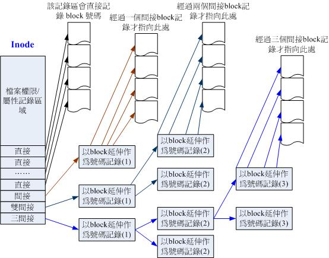

# 磁碟与档案系统管理

## 认识Linux档案系统

Linux最初档案系统使用的是EXT2。档案系统是建立在磁盘上的。

### 档案系统特性

磁碟分割完后需要格式化，系统才能使用这个系统档案系统。因为每个系统的档案属性/权限各不相同，为了存放这些档案所需的资料，因此需要将分割槽进行格式化。

每个系统能使用的档案系统并不相同。Windows 98以前的微软系统主要使用FAT(或FAT16)，windows2000后有所谓的NTFS。Linux正统档案系统则为Ext2(Linux second extended file system)。因此，windows默认不能识别Ext2。

傳統的磁碟與檔案系統之應用中，一個分割槽就是只能夠被格式化成為一個檔案系統，所以我們可以說一個 filesystem 	就是一個 partition。但是由於新技術的利用，例如我們常聽到的LVM與軟體磁碟陣列(software raid)， 	這些技術可以將一個分割槽格式化為多個檔案系統(例如LVM)，也能夠將多個分割槽合成一個檔案系統(LVM, RAID)！ 	所以說，目前我們在格式化時已經不再說成針對 partition 來格式化了， 	通常我們可以稱呼一個可被掛載的資料為一個檔案系統而不是一個分割槽喔！

較新的作業系統的檔案資料除了檔案實際內容外， 	通常含有非常多的屬性，例如 Linux 作業系統的檔案權限(rwx)與檔案屬性(擁有者、群組、時間參數等)。 	檔案系統通常會將這兩部份的資料分別存放在不同的區塊，權限與屬性放置到  	inode 中，至於實際資料則放置到 data block 區塊中。 	另外，還有一個超級區塊 (superblock) 會記錄整個檔案系統的整體資訊，包括 inode 與 block 的總量、使用量、剩餘量等。

每個 inode 與 block 都有編號，至於這三個資料的意義可以簡略說明如下：

- superblock：記錄此 filesystem 的整體資訊，包括inode/block的總量、使用量、剩餘量， 	以及檔案系統的格式與相關資訊等；
- inode：記錄檔案的屬性，一個檔案佔用一個inode，同時記錄此檔案的資料所在的 block 號碼；
- block：實際記錄檔案的內容，若檔案太大時，會佔用多個 block 。

***

如下图所示，假设一个档案属性与权限资料放在inode4号，这个inode记录了实际放置点为2, 7,13, 15这四个block号码。


这种存储资料的方法我们称为索引式档案系统(indexed allocation)。我们平时使用的优盘，一般使用的FAT。FAT这种格式档案系统并没有inode存在，所以FAT无法将这个档案的所有block一开始读取出来。每个block号码都记录在前一个block当中。


常常會聽到所謂的『磁碟重組』吧？需要磁碟重組的原因就是檔案寫入的 block 太過於離散了，此時檔案讀取的效能將會變的很差所致。 	這個時候可以透過磁碟重組將同一個檔案所屬的 blocks 彙整在一起，這樣資料的讀取會比較容易啊！

### Linux的EXT2档案系统(inode)

而且檔案系統一開始就將 inode 與 block 規劃好了，除非重新格式化(或者利用 resize2fs  	等指令變更檔案系統大小)，否則 inode 與 block 固定後就不再變動。但是如果仔細考慮一下，如果我的檔案系統高達數百GB時， 	那麼將所有的 inode 與 block 通通放置在一起將是很不智的決定，因為 inode 與 block 的數量太龐大，不容易管理。

為此之故，因此 Ext2 檔案系統在格式化的時候基本上是區分為多個區塊群組 (block group) 的，每個區塊群組都有獨立的  	inode/block/superblock 系統。


每一個區塊群組(block group)的六個主要內容說明如後：

#### data block (資料區塊)

| Block大小          | 1KB  | 2KB   | 4KB  |
| ------------------ | ---- | ----- | ---- |
| 最大单一档案限制   | 16GB | 256GB | 2TB  |
| 最大档案系统总容量 | 2TB  | 8TB   | 16TB |

Ext2还有如下限制:

* 原則上，block 的大小與數量在格式化完就不能夠再改變了(除非重新格式化)；
* 每個 block 內最多只能夠放置一個檔案的資料；

#### inode table (inode 表格)

inode记录的资料就是使用ls -l所显示的数据。

inode的大小与数量在格式化时就已经固定了

* inode大小固定为128 bytes (新的ext4与xfs可设定到256 bytes)
* 每个档案只占用一个inode
* 因此，档案系统能够建立的档案与inode书香有关
* 系统读取时先找到inode，并分析inode所记录的权限与使用者是否符合。

inode记录的资料非常多，偏偏只有128bytes而已，inode记录一个block号码要花掉4byte。如果要记录一个400MB的档案，需要十万个block号码的记录，但这是不可能的。所以，系统将inode记录block号码的区域定义为12个直接，一个间接，一个双间接，一个三间接记录区。



那么inode能指定多少个block呢？我们已1k block来说明，可指定的情况如下：

* 12个直接指向：12 * 1K = 12k

* 间接：(1024 / 4) * 1K = 256 * 1K = 256K

  记录每个block号码需要4bytes，所以1k大小的block能记录256笔记录

* 双间接：256 * 256 * 1K = 256^2K

* 三间接：256 * 256 * 256 * 1K = 256^3K

* 总额：16GB

但这个方法不能用在2k及4k block大小的计算中，因为大于2k的block将会收到Ext2档案系统本身的限制。

#### SuperBlock(超级区块)

Superblock 是記錄整個 filesystem 相關資訊的地方，记录的资料有：

- block 與 inode 的總量；
- 未使用與已使用的 inode / block 數量；
- block 與 inode 的大小 (block 為 1, 2, 4K，inode 為 128bytes 或 256bytes)；
- filesystem 的掛載時間、最近一次寫入資料的時間、最近一次檢驗磁碟 (fsck) 的時間等檔案系統的相關資訊；
- 一個 valid bit 數值，若此檔案系統已被掛載，則 valid bit 為 0 ，若未被掛載，則 valid bit 為 1 。

一般来说，superblock的大小为1024bytes。相关的superblock讯息用```dumpe2fs```指令查看。

此外，每个block group都有可能含有super block。后续如果含有superblock主要是为了第一个block group内的superblock的备份。

#### Filesystem Description (檔案系統描述說明)

這個區段可以描述每個 block group 的開始與結束的 block 號碼，以及說明每個區段 (superblock, bitmap, inodemap, 	data block) 分別介於哪一個 block 號碼之間。

#### block bitmap (區塊對照表)

从block bitmap当中可以知道哪些block是空的。

#### inode bitmap (inode 對照表)

记录使用与未使用的inode号码

#### dumpe2fs：查询superblock

新的xfs无法使用这个指令


### 与目录树的关系

#### 目录

我们建立一个目录时，档案系统至少会分配一个inode与至少一块block给该目录。inode记录该目录的相关权限与属性，并记录分配的那块block号码，block则是记录这个目录下的档名与该档名占用的inode号码资料。


#### 档案

当在ext2建立一般档案时，ext2分配一个inode和若干block

#### 目录树读取

新增/删除/改名档名与目录的W权限有关，是因为档名记录在目录的block当中，读取某个档案时，必须经过目录的inode与block