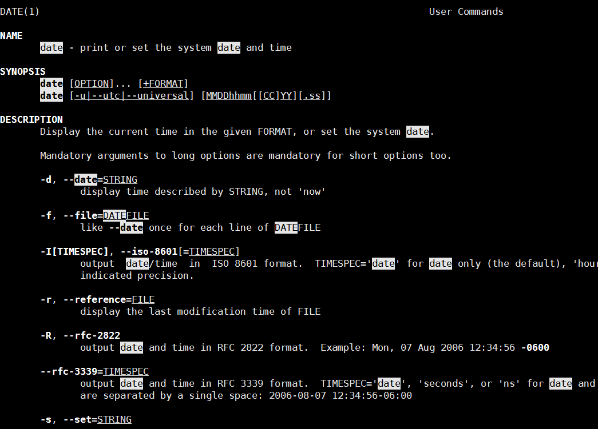

# 首次登陆与线上求助

## 首次登陆

*  重新啟動X Window的快速按鈕  alt + ctrl + backspace

## x window与文字模式切换

linux预设有六个terminal让使用者登陆，切换方式为ctrl + alt + [F2-F6]

纯文字模式下启动x window 

```bash
# 純文字界面下 (不能有 X 存在) 啟動視窗界面的作法
[dmtsai@study ~]$ startx
```

## 开始下达命令

```ba
[dmtsai@study ~]$ command  [-options]  parameter1  parameter2 ...
```

这些选项以空格区分，无论空几格都视为一格

## 语言支持

```bash
[surwall@hasee07 ~]$ locale # tty下不支持中文
[surwall@hasee07 ~]$ LANG=en_US.UTF-8
[surwall@hasee07 ~]$ export LC_ALL=en_US.UTF-8 # 同步更新
[surwall@hasee07 ~]$ date # 输出日期
```

## 基础操作

### 显示日期

```bash
[dmtsai@study ~]$ date +%Y/%m/%d
2015/05/29
[dmtsai@study ~]$ date +%H:%M
14:33
```

### 显示日历

```bash
[dmtsai@study ~]$ cal
      May 2015
Su Mo Tu We Th Fr Sa
                1  2
 3  4  5  6  7  8  9
10 11 12 13 14 15 16
17 18 19 20 21 22 23
24 25 26 27 28 29 30
31

[dmtsai@study ~]$ cal [month] [year]
```

### 简易计算器

```bash
[root@hasee07 surwall]# bc
bc 1.06.95
Copyright 1991-1994, 1997, 1998, 2000, 2004, 2006 Free Software Foundation, Inc.
This is free software with ABSOLUTELY NO WARRANTY.
For details type `warranty'. 
2 + 3
5
quit # 退出
# bc默认输出整数
scale # 调整小数点个数
0
scale = 3

1 / 3
.333
scale = 4
1/4
.2500

```

## 快捷键

```bash
[root@hasee07]#cal[tab][tab] # 一下自动补全，两下列出所有
cal            calibrate_ppa  caller 
[surwall@hasee07]$ls -al ~/.bash
.bash_history  .bash_logout   .bash_profile  .bashrc

[surwall@hasee07]$date --[tab][tab] # 列出命令
--date        --date=       --help        --iso-8601    --reference=  --rfc-2822    --rfc-3339=   --set=        --universal   --version 
```

*  [shift]+{[PageUP]|[Page Down]}按鍵 : 翻页

## 线上求助

```bash
[surwall@hasee07]$date --help
[surwall@hasee07]$man date
```

man date输出如下

```bash
DATE(1)                                                                    User Commands                                                                    DATE(1)

NAME
       date - print or set the system date and time

SYNOPSIS
       date [OPTION]... [+FORMAT]
       date [-u|--utc|--universal] [MMDDhhmm[[CC]YY][.ss]]
...
```

那个DATE(1)是什么意思呢？

| 代号 | 内容                                  |
| ---- | ------------------------------------- |
| 1    | 使用者可在shell中操控的指令           |
| 2    | 系统核心可呼叫的函数与工具            |
| 3    | 一些常用的函数库，通常为c函数库(libc) |
| 4    | 装置档案的说明,通常在/dev下的档案     |
| 5    | 设定档或是某些档案的格式              |
| 6    | games                                 |
| 7    | 惯例与协定                            |
| 8    | 系统管理员可用指令                    |
| 9    | 和kernel有关文件                      |

可使用```man man```了解更多

查看man时可用```/```搜寻关键字



### man page 常用按键

| 按键         | 功能                           |
| ------------ | ------------------------------ |
| [Page up]    | 向上一页                       |
| [Page Down]  | 向下一页                       |
| [Home]/[End] | 去向第一页/最后一页            |
| /string      | 向下搜寻string这个词           |
| ?string      | 向上搜寻string                 |
| n, N         | 下一个搜寻结果，上一个搜寻结构 |

### man page位置

既然有man page那么肯定储存在某个地方，一般存在是放在/usr/share/man，可以通过修改man的搜寻路径，改变目录。修改/etc/man_db.conf(有的版本为man.conf或manpath.conf或man.config)。更多可看man man

### 搜寻特定man page

```bash
[surwall@hasee07]$man -f man
man (1)              - an interface to the on-line reference manuals
man (1p)             - display system documentation
man (7)              - macros to format man pages
```

```bash
[surwall@hasee07]$man 7 man <== 指定某个文档
```

### 搜寻特定词

```bash
[surwall@hasee07]$man -k connect
ac (1)               - print statistics about users' connect time
accept (2)           - accept a connection on a socket
accept (3p)          - accept a new connection on a socket
accept4 (2)          - accept a connection on a socket
aconnect (1)         - ALSA sequencer connection manager
aseqnet (1)          - ALSA sequencer connectors over network
connect (2)          - initiate a connection on a socket
connect (3p)         - connect a socket
ConnectionNumber (3) - Display macros and functions
```

>```bash
>[dmtsai@study ~]$ whatis  [指令或者是資料]   <==相當於 man -f [指令或者是資料]
>[dmtsai@study ~]$ apropos [指令或者是資料]   <==相當於 man -k [指令或者是資料]
>```

上述两个指令要使用，必须以root身份建立whatis资料库

```bash
[root@study ~]# mandb
# 舊版的 Linux 這個指令是使用 makewhatis 喔！這一版開使用 mandb 了！
```

### info page

info文件存在```/user/share/info```


| 按键    | 功能                         |
| ------- | ---------------------------- |
| [tab]   | node之间移动                 |
| [enter] | 游标在node*上，进入node      |
| b       | 移动到该info中的第一个info   |
| e       | 移动到该info中的最后一个info |
| TODO    | TODO                         |
|         |                              |
|         |                              |
|         |                              |

### 其他有用的文档(documents)

通常在```/usr/share/doc```

## nano编辑器

```bash
[surwall@hasee07]$nano text.txt
```

* ctrl + R：从其他文档读取资料，将内容粘贴到本文档
* ctrl + _：快速移动到某行
* Alt + M：支持鼠标

## 正确的开机方法

* 观察系统的使用状态

```bash
[surwall@hasee07]$who
root     pts/0        2019-11-18 22:03 (gateway)
surwall  :0           2019-11-18 20:35 (:0)
surwall  pts/1        2019-11-18 21:55 (:0)

```

* 查看网络连接状态

```bash
[surwall@hasee07]$netstat -a
Active Internet connections (servers and established)
Proto Recv-Q Send-Q Local Address           Foreign Address         State      
tcp        0      0 localhost:ipp           0.0.0.0:*               LISTEN     
tcp        0      0 localhost:smtp          0.0.0.0:*               LISTEN     
tcp        0      0 localhos:x11-ssh-offset 0.0.0.0:*               LISTEN     
tcp        0      0 0.0.0.0:sunrpc          0.0.0.0:*               LISTEN     
tcp        0      0 hasee07:domain          0.0.0.0:*               LISTEN     
tcp        0      0 0.0.0.0:ssh             0.0.0.0:*               LISTEN     
tcp        0      0 hasee07:ssh             gateway:8385            ESTABLISHED
tcp6       0      0 localhost:ipp           [::]:*                  LISTEN     
tcp6       0      0 localhost:smtp          [::]:*                  LISTEN     
tcp6       0      0 localhos:x11-ssh-offset [::]:*                  LISTEN     
tcp6       0      0 [::]:sunrpc             [::]:*                  LISTEN     
tcp6       0      0 [::]:ssh                [::]:*                  LISTEN    
```

### 同步资料写入磁盘

```bash
[surwall@hasee07]$sync
[surwall@hasee07]$su # 使用root更新所有资料
密码：
[root@hasee07]#sync
```

### 常用关机指令 shutdown

```bash
[root@study ~]# /sbin/shutdown [-krhc] [時間] [警告訊息]
選項與參數：
-k     ： 不要真的關機，只是發送警告訊息出去！
-r     ： 在將系統的服務停掉之後就重新開機(常用)
-h     ： 將系統的服務停掉後，立即關機。 (常用)
-c     ： 取消已經在進行的 shutdown 指令內容。
時間   ： 指定系統關機的時間！時間的範例底下會說明。若沒有這個項目，則預設 1 分鐘後自動進行。
範例：
[root@study ~]# /sbin/shutdown -h 10 'I will shutdown after 10 mins'
Broadcast message from root@study.centos.vbird (Tue 2015-06-02 10:51:34 CST):

I will shutdown after 10 mins
The system is going down for power-off at Tue 2015-06-02 11:01:34 CST!
```

```bash
[root@study ~]# shutdown -h now
立刻關機，其中 now 相當於時間為 0 的狀態
[root@study ~]# shutdown -h 20:25
系統在今天的 20:25 分會關機，若在21:25才下達此指令，則隔天才關機
[root@study ~]# shutdown -h +10
系統再過十分鐘後自動關機
[root@study ~]# shutdown -r now
系統立刻重新開機
[root@study ~]# shutdown -r +30 'The system will reboot' 
再過三十分鐘系統會重新開機，並顯示後面的訊息給所有在線上的使用者
[root@study ~]# shutdown -k now 'This system will reboot' 
僅發出警告信件的參數！系統並不會關機啦！嚇唬人！
```

### 重新开关机

```bash
[root@study ~]# sync; sync; sync; reboot
[root@study ~]# halt      # 系統停止～螢幕可能會保留系統已經停止的訊息！
[root@study ~]# poweroff  # 系統關機，所以沒有提供額外的電力，螢幕空白！
```

### 使用系统工具systemctl

```bash
[root@study ~]# systemctl [指令]
指令項目包括如下：
halt       進入系統停止的模式，螢幕可能會保留一些訊息，這與你的電源管理模式有關
poweroff   進入系統關機模式，直接關機沒有提供電力喔！
reboot     直接重新開機
suspend    進入休眠模式

[root@study ~]# systemctl reboot    # 系統重新開機
[root@study ~]# systemctl poweroff  # 系統關機
```


# ps

## 如何关闭xwindow

```bash
[surwall@hasee07 ~]$ ps -t tty1
  PID TTY          TIME CMD
11964 tty1     00:00:06 X
[surwall@hasee07 ~]$ kill -9 11964
```

## 如何开启xwindow

```bash
[surwall@hasee07 ~]$ startx
```


## 如何修改默认语系
```bash
[root@hasee07]#nano /etc/locale.conf
[root@hasee07]#cat /etc/locale.conf
LANG="en_US.UTF-8"
```


