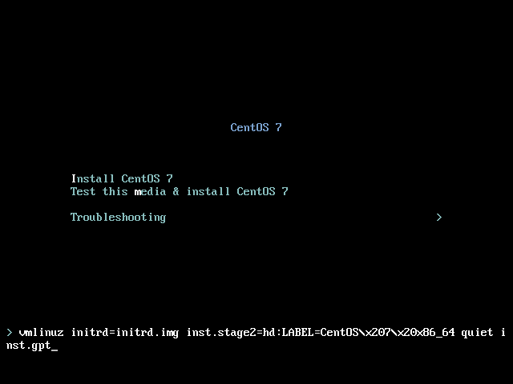

# 开始安装centos

## 选择安装模式与开机

* 磁盘小于2t默认使用mbr，使用inst.gpt 强制使用gpt安装

## centos网卡命名规则

[链接](https://access.redhat.com/documentation/en-us/red_hat_enterprise_linux/7/html/networking_guide/sec-understanding_the_predictable_network_interface_device_names)

## 内存测试

 memtest86 

开机选择trouble shooting，然后选memory test

