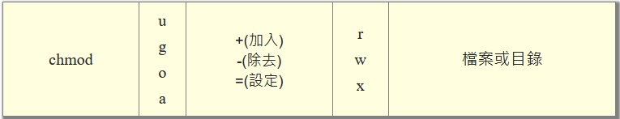
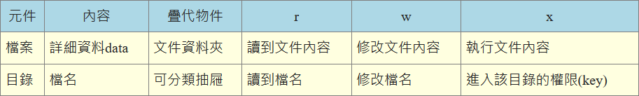
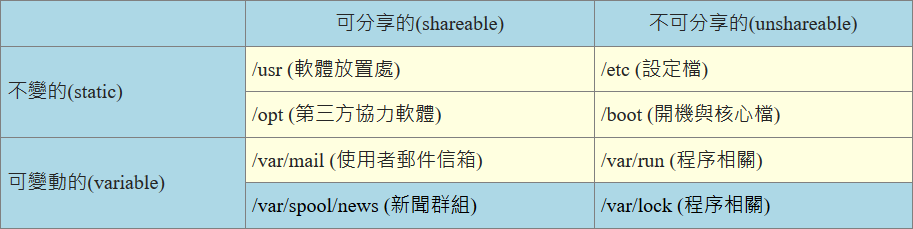

# 档案权限与目录设置

## 使用者与群组

Linux是个多人多工的系统，存在使用者user和群组group

群组的存在是为了团队之间更改文件。

* 通过```/etc/passwd```查看所有账号
* 通过```/etc/shadow```查看密码
* 通过```/etc/group```查看群组名

## 档案权限 file ownership and permission

```bash
[root@hasee07]# ls -al
total 48
dr-xr-x---.  5 root root  286 Nov 20 13:49 .
dr-xr-xr-x. 17 root root  224 Nov 18 15:28 ..
-rw-------.  1 root root  106 Nov 18 22:03 .Xauthority
-rw-------.  1 root root 1241 Nov 19 23:24 .bash_history
-rw-r--r--.  1 root root   18 Dec 29  2013 .bash_logout
-rw-r--r--.  1 root root  176 Dec 29  2013 .bash_profile
-rw-r--r--.  1 root root  254 Nov 18 20:32 .bashrc
drwx------.  4 root root   31 Nov 18 16:35 .cache
drwxr-xr-x.  3 root root   18 Nov 18 16:35 .config
-rw-r--r--.  1 root root  100 Dec 29  2013 .cshrc
drwx------.  3 root root   25 Nov 18 15:32 .dbus
-rw-r--r--.  1 root root  129 Dec 29  2013 .tcshrc
-rw-r-----.  1 root root    5 Nov 20 13:49 .vboxclient-display-svga.pid
-rw-------.  1 root root 3410 Nov 18 20:32 .viminfo
-rw-r--r--.  1 root root  193 Nov 18 20:24 12
-rw-------.  1 root root 1760 Nov 18 15:29 anaconda-ks.cfg
-rw-r--r--.  1 root root 1808 Nov 18 15:33 initial-setup-ks.cfg
```


### 了解文件类型与权限


第一个File代表：

* 当为```d```时为目录directory
* 当为```-```时为文件
* 当为```l```时为连结档(link file)
* 当为```b```时为可供储存的周边设备block device file
* 当为```c```时为序列埠设备character device file

第二栏表示有多少文件连接到此节点(i-node):
* 每个文件都会将属性与权限记录到系统的节点中

第四栏表示文件大小，预设为Bytes  

第五栏显示建档或是修改日期
* 如果时间太久远只会显示年份，如要显示完整时间，使用```ls -l --full-time```
```bash
[root@hasee07]# ls -l
total 12
-rw-r--r--. 1 root root  193 Nov 18 20:24 12
-rw-------. 1 root root 1760 Nov 18 15:29 anaconda-ks.cfg
-rw-r--r--. 1 root root 1808 Nov 18 15:33 initial-setup-ks.cfg
[root@hasee07]# ls -l --full-time
total 12
-rw-r--r--. 1 root root  193 2019-11-18 20:24:15.596529937 +0800 12
-rw-------. 1 root root 1760 2019-11-18 15:29:42.045487628 +0800 anaconda-ks.cfg
-rw-r--r--. 1 root root 1808 2019-11-18 15:33:05.921000100 +0800 initial-setup-ks.cfg
```

第七栏表示文件名
* ```.```代表隐藏文件，必须使用```ls -a```才能显示

### 如何改变文档文档属性与权限
* 改变所属群组
```bash
[root@hasee07]# chgrp [-R] dirname/filename ...
[root@hasee07]# ls -l
total 12
-rw-r--r--. 1 root root  193 Nov 18 20:24 12
-rw-------. 1 root root 1760 Nov 18 15:29 anaconda-ks.cfg
-rw-r--r--. 1 root root 1808 Nov 18 15:33 initial-setup-ks.cfg
[root@hasee07]# chgrp users initial-setup-ks.cfg
[root@hasee07]# ls -l
total 12
-rw-r--r--. 1 root root   193 Nov 18 20:24 12
-rw-------. 1 root root  1760 Nov 18 15:29 anaconda-ks.cfg
-rw-r--r--. 1 root users 1808 Nov 18 15:33 initial-setup-ks.cfg
[root@hasee07]#chgrp testing initial-setup-ks.cfg
chgrp: invalid group: 'testing' # 组名不存在
```
* 改变档案拥有者owner
chown的用途還滿多的，他還可以順便直接修改群組的名稱呢！
```bash
[root@hasee07]# chown [-R] 帳號名稱 檔案或目錄
[root@hasee07]# chown [-R] 帳號名稱:群組名稱 檔案或目錄
[root@hasee07]# chown bin initial-setup-ks.cfg
[root@hasee07]# ls -l
total 12
-rw-r--r--. 1 root root   193 Nov 18 20:24 12
-rw-------. 1 root root  1760 Nov 18 15:29 anaconda-ks.cfg
-rw-r--r--. 1 bin  users 1808 Nov 18 15:33 initial-setup-ks.cfg
[root@hasee07]# chown root:root initial-setup-ks.cfg
[root@hasee07]# ls -l
total 12
-rw-r--r--. 1 root root  193 Nov 18 20:24 12
-rw-------. 1 root root 1760 Nov 18 15:29 anaconda-ks.cfg
-rw-r--r--. 1 root root 1808 Nov 18 15:33 initial-setup-ks.cfg
```
> 事實上，chown也可以使用『chown user.group file』，亦即在擁有者與群組間加上小數點『 . 』也行！ 不過很多朋友設定帳號時，喜歡在帳號當中加入小數點(例如vbird.tsai這樣的帳號格式)，這就會造成系統的誤判了！ 所以我們比較建議使用冒號『:』來隔開擁有者與群組啦！此外，chown也能單純的修改所屬群組呢！ 例如『chown .sshd initial-setup-ks.cfg』就是修改群組

什么时候该使用chown或chgrp,当然是复制文档给别人时了，用复制cp指令
```bash
[root@hasee07]# cp 来源文档 目的文档
[root@hasee07]# cp .bashrc .bashrc_test
[root@hasee07]# ls -al .bashrc*
-rw-r--r--. 1 root root 254 Nov 18 20:32 .bashrc
-rw-r--r--. 1 root root 254 Nov 20 15:15 .bashrc_test
```

* 改变权限chmod
    * 数字类型改变文件权限
    可使用数字代表各权限  
        * r:4
        * w:2
        * x:1  
    
    每种身份的权限是需要累加的，当权限为[-rwxrwx---]为：  
    owner = rwx = 4 + 2 + 1 = 7  
    group = rwx = 4 + 2 + 1 = 7  
    others = --- = 0 + 0 + 0 = 0  
    变更权限chmod用法：
    ```bash
    [root@hasee07]# chmod [-R] xyz 檔案或目錄
    [root@hasee07]# ls -al .bashrc
    -rw-r--r--. 1 root root 254 Nov 18 20:32 .bashrc
    [root@hasee07]# chmod 777 .bashrc
    [root@hasee07]# ls -al .bashrc
    -rwxrwxrwx. 1 root root 254 Nov 18 20:32 .bashrc
    ```

    * 符号类型改变文件权限  
    我们可以用u,g,o,a分别代表user,group,others,all
    
    ```bash
    [root@hasee07]#chmod u=rwx,go=rx .bashrc
    [root@hasee07]#ls -l .bashrc
    -rwxr-xr-x. 1 root root 254 Nov 18 20:32 .bashrc
    ```
    如果我不知道原先的权限，只想给每个人增加可写入的权限，可以使用：  
    ```bash
    [root@hasee07]#ls -l .bashrc
    -rwxr-xr-x. 1 root root 254 Nov 18 20:32 .bashrc
    [root@hasee07]#chmod a+w .bashrc
    [root@hasee07]#ls -l .bashrc
    -rwxrwxrwx. 1 root root 254 Nov 18 20:32 .bashrc
    ```

### 文件夹与文件权限意义
* 权限对文件的意义
    * r (read)：可讀取此一檔案的實際內容，如讀取文字檔的文字內容等；
    * w (write)：可以編輯、新增或者是修改該檔案的內容(但不含刪除該檔案)；
    * x (Execute)：該檔案具有可以被系統執行的權限。
* 权限对文件夹的意义
    * r (read contents in directory)：  
    读取文件夹内的文件
    * x (access directory):  
        * 建立新的檔案與目錄；
        * 刪除已經存在的檔案與目錄(不論該檔案的權限為何！)
        * 將已存在的檔案或目錄進行更名；
        * 搬移該目錄內的檔案、目錄位置。  
    * w (modify contents of directory)：  
    目錄的x代表的是使用者能否進入該目錄成為工作目錄的用途，什么是工作目录，所謂的工作目錄(work directory)就是你目前所在的目錄啦！  
    access metadata about files in the directory (the information that is listed in an ls -l).  
    
    


### Linux档案种类与副档名
* 档案种类
    * 正规档案（regular file）:
    正规文档又分为：
        1. 纯文字档(ASCII):
        2. 二进制档(binary):
        3. 资料格式档(data):
          有些程式在運作的過程當中會讀取某些特定格式的檔案，那些特定格式的檔案可以被稱為資料檔 (data file)。舉例來說，我們的Linux在使用者登入時，都會將登錄的資料記錄在 /var/log/wtmp那個檔案內，該檔案是一個data file，他能夠透過last這個指令讀出來！
    * 目录(directory)
    * 连结档(link):
    * 设备与装置档(device):
        * 区块设备(block)档：
        * 字节(character)设备档：一次性读取，不能截断输出，例如鼠标，键盘
    * 资料接口档(socket)：
    用来网络资料对接
    * 资料输送档(FIFO, pipe):
    解决多个程序同时存取一个档案所造成的错误问题FIFO(First-in-first-out)。属性为\[p\]
* 副档名
    * *.sh:脚本名
    * *Z, *.tar, *.tar.gz, *.tgz: 经过打包的压缩档
* 档名长度限制
单一文件名最多255bytes。
* 档名限制
避免```* ? > < ; & ! [ ] | \ ' " ` ( ) { }```

## 目录配置
### Linux配置的依据--FHS
存在许多distributions，所以需要一套标准[Filesystem Hierarchy Standard(FHS)](http://refspecs.linuxfoundation.org/FHS_3.0/fhs-3.0.pdf)

可分享的：分享给其他系统挂载的
不可分享的：与自身机器相关
/usr(unix software resource):与软件安装执行有关   
/var(variable):与系统运作有关

* 根(/)目录的意义:
因为根目录与开机、还原、系统修复等动作有关。FHS要求根目录不要放太大分割槽，放入越多资料，越有可能出错。

#### FHS要求必须存在的目录
| 目录 | 应放置内容 |
| --- | --- |
| /boot | The /boot/ directory contains static files required to boot the system, such as the Linux kernel. These files are essential for the system to boot properly.  |
| /dev | The /dev/ directory contains file system entries which represent devices that are attached to the system. These files are essential for the system to function properly. |
| /etc |The /etc/ directory is reserved for configuration files that are local to the machine. No binaries are to be placed in /etc/. Any binaries that were once located in /etc/ should be placed into /sbin/ or /bin/.  |
| /etc/opt(必要) | 第三方软件相关设定 |
| /etc/X11 | 有关于X Window设定 |
|  /etc/skel/ | for "skeleton" user files, which are used to populate a home directory when a user is first created. |
| /lib | 系統的函式庫非常的多，而/lib放置的則是在開機時會用到的函式庫， 以及在/bin或/sbin底下的指令會呼叫的函式庫而已。 |
| /lib/modules | 這個目錄主要放置可抽換式的核心相關模組(驅動程式)喔 |
| /media | The /media/ directory contains subdirectories used as mount points for removeable media, such as 3.5 diskettes, CD-ROMs, and Zip disks. |
| /mnt |  The /mnt/ directory is reserved for temporarily mounted file systems, such as NFS file system mounts. For all removeable media, use the /media/ directory. |
| /opt | The /opt/ directory provides storage for large, static application software packages. |
| /run | 	早期的 FHS 規定系統開機後所產生的各項資訊應該要放置到 /var/run 目錄下，新版的 FHS 則規範到 /run 底下。 由於 /run 可以使用記憶體來模擬，因此效能上會好很多！|
| /sbin | Linux有非常多指令是用來設定系統環境的，這些指令只有root才能夠利用來『設定』系統，其他使用者最多只能用來『查詢』而已。 放在/sbin底下的為開機過程中所需要的，裡面包括了開機、修復、還原系統所需要的指令。 至於某些伺服器軟體程式，一般則放置到/usr/sbin/當中。至於本機自行安裝的軟體所產生的系統執行檔(system binary)， 則放置到/usr/local/sbin/當中了。常見的指令包括：fdisk, fsck, ifconfig, mkfs等等。|
| /srv | srv可以視為『service』的縮寫，是一些網路服務啟動之後，這些服務所需要取用的資料目錄。 常見的服務例如WWW, FTP等等。舉例來說，WWW伺服器需要的網頁資料就可以放置在/srv/www/裡面。 不過，系統的服務資料如果尚未要提供給網際網路任何人瀏覽的話，預設還是建議放置到 /var/lib 底下即可。|
| /tmp | 這是讓一般使用者或者是正在執行的程序暫時放置檔案的地方。|

重要的目录
| 目录 | 应放置的内容 |
| --- | --- |
| /lost+found | 這個目錄是使用標準的ext2/ext3/ext4檔案系統格式才會產生的一個目錄，目的在於當檔案系統發生錯誤時， 將一些遺失的片段放置到這個目錄下。不過如果使用的是 xfs 檔案系統的話，就不會存在這個目錄了！|
| /proc | 這個目錄本身是一個『虛擬檔案系統(virtual filesystem)』喔！他放置的資料都是在記憶體當中， 例如系統核心、行程資訊(process)、周邊裝置的狀態及網路狀態等等。因為這個目錄下的資料都是在記憶體當中， 所以本身不佔任何硬碟空間啊！比較重要的檔案例如：/proc/cpuinfo, /proc/dma, /proc/interrupts, /proc/ioports, /proc/net/* 等等。|
| /sys | 	這個目錄其實跟/proc非常類似，也是一個虛擬的檔案系統，主要也是記錄核心與系統硬體資訊較相關的資訊。 |

#### usr的意义及内容
FHS建议存在目录
| 目录 | 应存放内容 |
| --- | --- |
| /usr/bin | 一般用户使用的指令都存放在这。而且centos7通过连结档将/bin连结至此 |
| /usr/lib | almost with /lib |
| /usr/local | 管理员自行安装的软件存放处 |
| /usr/sbin/ | 非必须的系统指令 |
| /usr/share | 放置只读文件 |
| /usr/share/man | 线上说明
| /usr/share/doc | 软件杂项说明 |
| /usr/share/zoneinfo | 时区档案 |
FHS建议存在的目录
| 目录 | 存放 |
| --- | --- |
| /usr/games | 游戏有关 |
| /usr/include |c/c++等语言header包含档(include)放置处 |
| /usr/libexec | 不常用的执行档或是脚本 |
| /usr/src/ | 源码，核心源码放在/usr/src/linux/ |

#### var意义及内容
| 目录 | 内容 |
| --- | --- |
| var/cache | Application cache data |
| var/lib | Variable state information 程式本身執行的過程中，需要使用到的資料檔案放置的目錄。在此目錄下各自的軟體應該要有各自的目錄。 舉例來說，MySQL的資料庫放置到/var/lib/mysql/而rpm的資料庫則放到/var/lib/rpm去！|
| var/lock | Lock files 	某些裝置或者是檔案資源一次只能被一個應用程式所使用，如果同時有兩個程式使用該裝置時， 就可能產生一些錯誤的狀況，因此就得要將該裝置上鎖(lock)，以確保該裝置只會給單一軟體所使用。 舉例來說，燒錄機正在燒錄一塊光碟，你想一下，會不會有兩個人同時在使用一個燒錄機燒片？ 如果兩個人同時燒錄，那片子寫入的是誰的資料？所以當第一個人在燒錄時該燒錄機就會被上鎖， 第二個人就得要該裝置被解除鎖定(就是前一個人用完了)才能夠繼續使用囉。目前此目錄也已經挪到 /run/lock 中！|
| var/log | 重要到不行！這是登錄檔放置的目錄！裡面比較重要的檔案如/var/log/messages, /var/log/wtmp(記錄登入者的資訊)等。 |
| var/mail | 放置個人電子郵件信箱的目錄，不過這個目錄也被放置到/var/spool/mail/目錄中！ 通常這兩個目錄是互為連結檔啦！ |
| var/run | Data relevant to running processes 某些程式或者是服務啟動後，會將他們的PID放置在這個目錄下喔！至於PID的意義我們會在後續章節提到的。 與 /run 相同，這個目錄連結到 /run 去了！ |
| var/spool | Application spool data 	這個目錄通常放置一些佇列資料，所謂的『佇列』就是排隊等待其他程式使用的資料啦！ 這些資料被使用後通常都會被刪除。舉例來說，系統收到新信會放置到/var/spool/mail/中， 但使用者收下該信件後該封信原則上就會被刪除。信件如果暫時寄不出去會被放到/var/spool/mqueue/中， 等到被送出後就被刪除。|


### 目录树(directory tree)
* 目錄樹的啟始點為根目錄 (/, root)；
* 每一個目錄不止能使用本地端的 partition 的檔案系統，也可以使用網路上的 filesystem 。舉例來說， 可以利用 Network File System (NFS) 伺服器掛載某特定目錄等。


## centos观察
除了FHS之外，还有Linux Standard Base(LSB)可以依循
```bash
[surwall@hasee07]$uname -r # 核心版本
3.10.0-1062.el7.x86_64
[surwall@hasee07]$uname -m # 检查系统位版本
x86_64
# 2. 假設你的 CentOS 7 確實有網路可以使用的情況下 (要用 root 的身份)
[root@hasee07]# yum install redhat-lsb   # yum 的用法後面章節才會介紹
[root@hasee07]#lsb_release -a
LSB Version:	:core-4.1-amd64:core-4.1-noarch:cxx-4.1-amd64:cxx-4.1-noarch:desktop-4.1-amd64:desktop-4.1-noarch:languages-4.1-amd64:languages-4.1-noarch:printing-4.1-amd64:printing-4.1-noarch
Distributor ID:	CentOS
Description:	CentOS Linux release 7.7.1908 (Core)
Release:	7.7.1908
Codename:	Core
```